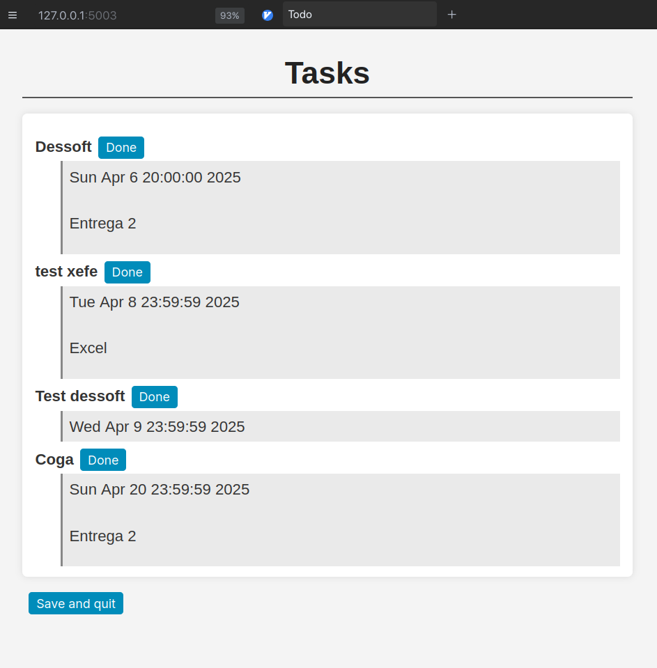

# todo

## Name
Todo - A simple to-do list for the terminal written in C.
You can add tasks with dates and retrieve them later
by time frames like a week.

## Synopsis
todo [OPTIONS]

## Description
run todo -help. If you need more documentation, read the source code.

## Version Status
Currently it is stable enought to be used.

# Http task visualizer

Running `todo -serve` creates a daemon that serve a http client
in the address returned by the command.

